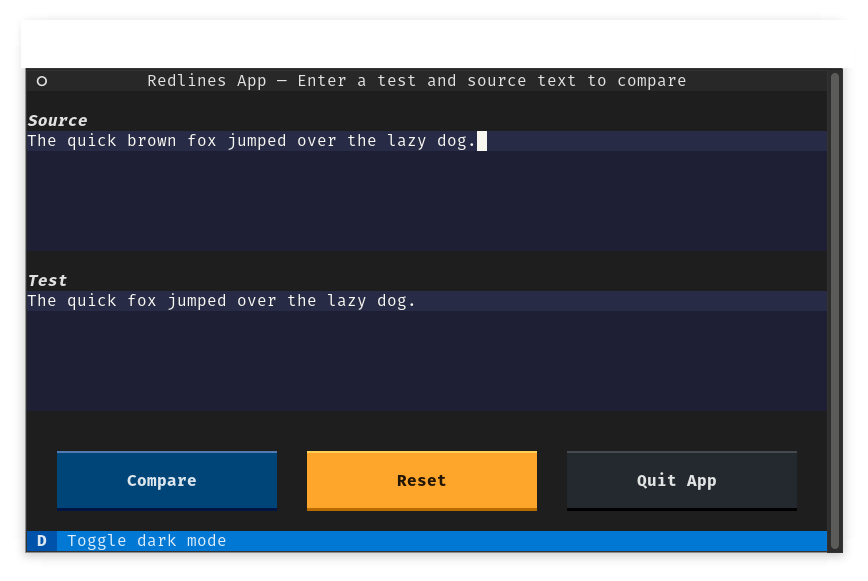
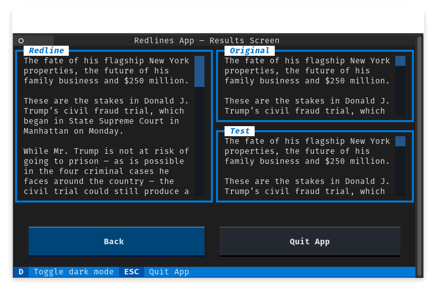

# redlines-textual

This textual (web) app is a demo for redlines.

It is updated from time to time to display capabilities of the library.

## Running locally

1. Clone this repository
2. Install the dependencies: `poetry install`
3. Run the command line interface: `redlines-textual`

You can also serve the app through [textual-web](https://github.com/Textualize/textual-web)
by following the install instructions and running `textual-web --config serve.toml`

## License 
MIT